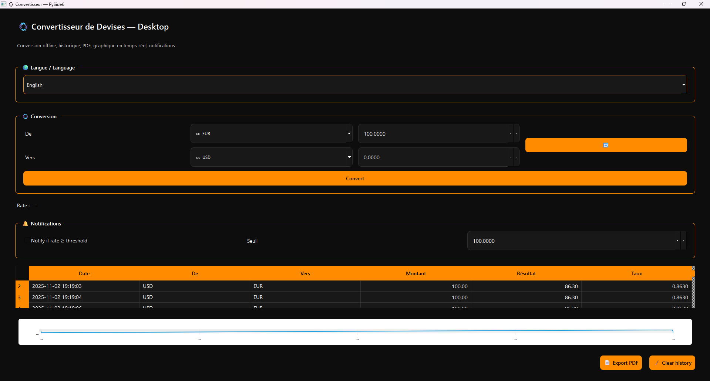

# 💱 Convertisseur de Devises — Desktop App (PySide6)

> Une application Desktop professionnelle de conversion de devises avec UI moderne (fintech), graphique en temps réel, historique SQLite, export PDF et notifications système.



---

## 🏆 Fonctionnalités principales

| Catégorie | Fonction |
|---|---|
💱 Conversion | Convertit entre +150 devises (offline support)  
📈 Graphique | Historique temps réel des taux  
🗃️ Historique | Sauvegarde SQLite intégrée  
📦 Export PDF | Sauvegarde les conversions en PDF  
🔔 Notifications | Alerte seuil de taux  
🧠 Auto-complétion | Recherche de devise + drapeau 🇫🇷🇺🇸  
🌍 Multi-langue | Français / Anglais  
🎨 UI / UX moderne | Fintech style: Dark / Orange / White  
🧱 Architecture | Clean Architecture (modulaire, scalable)  

---

## 🖥️ Interface Aperçu

> Interface pensée **desktop**, look fintech moderne

| Accueil | Graphique |
|---|---|
 | 

*(Place tes screenshots dans `/docs/screenshots/`)*

---

## 🚀 Démarrage

### 🔧 Installation

```bash
git clone https://github.com/USERNAME/currency-converter-pyside6.git
cd currency-converter-pyside6
python -m venv .venv
source .venv/Scripts/activate  # Windows
pip install -r requirements.txt
